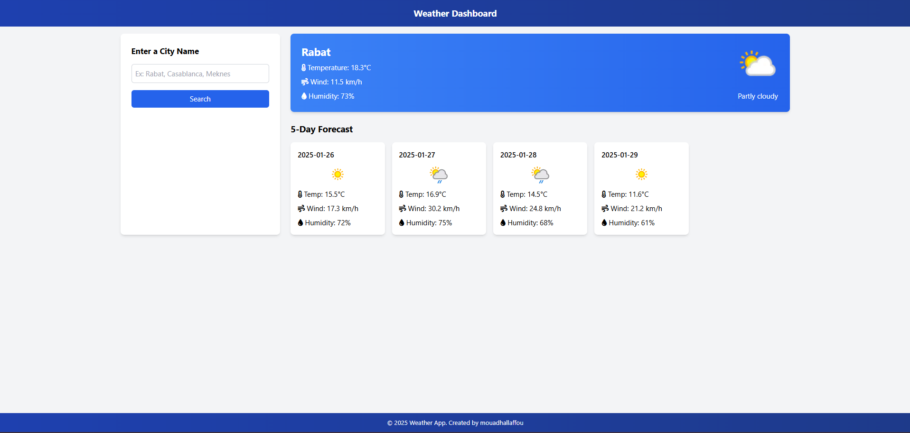

# Weather App 🌦️



Une application météo simple, intuitive et responsive qui affiche les conditions météorologiques actuelles et les prévisions sur 5 jours pour une ville donnée. Développée avec **HTML**, **Tailwind CSS**, et **JavaScript**, en utilisant l'API [WeatherAPI](https://www.weatherapi.com/).

---

## Fonctionnalités 🚀

- **Recherche par ville** : Entrez le nom d'une ville pour obtenir les données météo.
- **Données actuelles** : Affiche la température, le vent, l'humidité et les conditions météo actuelles.
- **Prévisions sur 5 jours** : Affiche les prévisions météo pour les 5 prochains jours.
- **Design moderne et responsive** : L'application s'adapte à tous les écrans (mobile, tablette, ordinateur).
- **Spinner de chargement** : Un spinner s'affiche pendant le chargement des données pour une meilleure expérience utilisateur.

---

## Technologies Utilisées 🛠️

- **HTML** : Structure de la page.
- **Tailwind CSS** : Design et mise en page.
- **JavaScript** : Logique de l'application.
- **WeatherAPI** : Récupération des données météo.
- **Font Awesome** : Icônes pour une meilleure expérience utilisateur.

---

## Comment Utiliser l'Application 🖥️

### 1. Cloner le Projet

Clonez ce dépôt sur votre machine locale :

```bash
git clone https://github.com/MouadHallaffou/Weather_App.git

